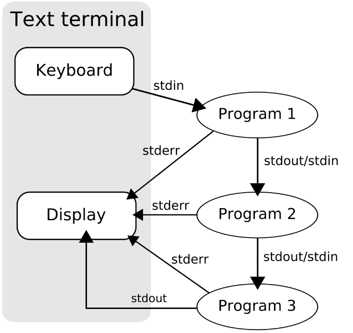
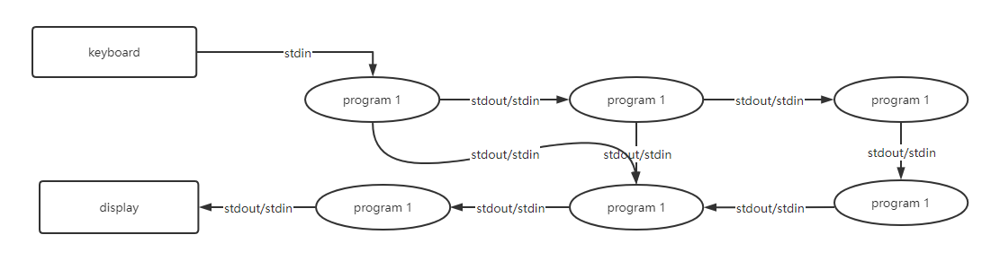
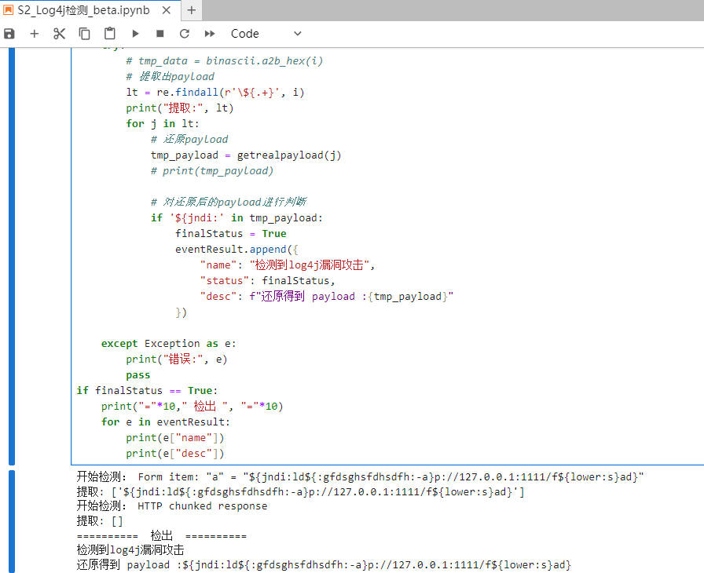
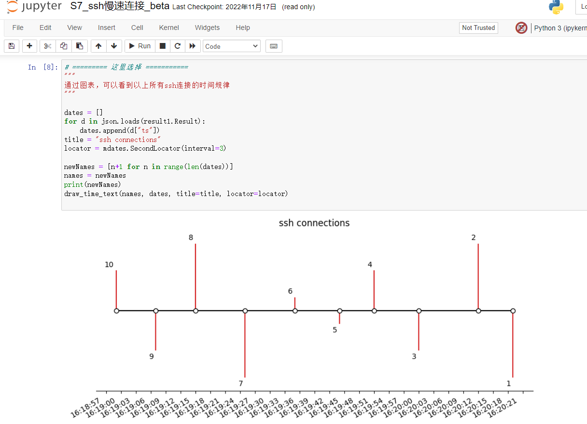
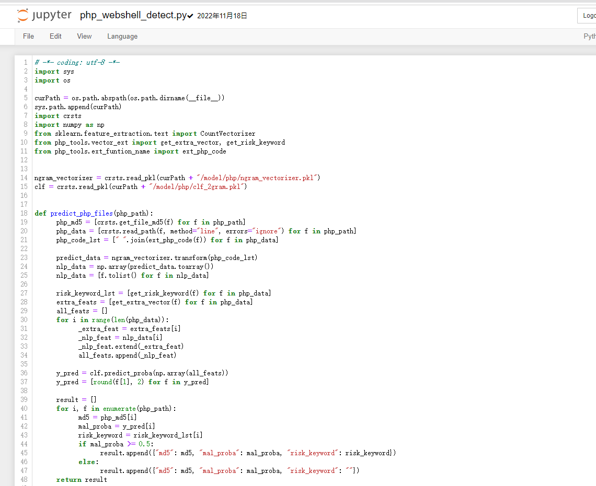

## 调查分析功能说明

### 描述

调查分析功能，主要为对接各数据源接口、和各类处理引擎、处理过程，并使用管道的数据处理流程，最终获得目标数据的过程。

### 概念

1、管道数据处理流程

在类Unix操作系统中，管道是一系列将标准输入输出链接起来的进程，其中每一个进程的输出被直接作为下一个进程的输入。 每一个链接都由匿名管道实现。管道中的组成元素也被称作过滤程序。 这个概念是由道格拉斯·麦克罗伊为Unix 命令行发明的，因与物理上的管道相似而得名。



而在研究过程中，也发现了较多产品如 splunk 、sentinel 也使用了类似的思路实现静态语句，我们这里也是借鉴此概念。不过普遍仍是单流程管道，因此我们对此概念做了更进一步的升级 ————  从单一流的管道到多流管道的升级。并且独立设计了查询语言。



### 查询功能使用示例

1. 数据提取与处理

1.1 查询流量包数据

通过在流量包上传页面上传流量包后,则可以通过 pcap 模块, 获取流量包的数据.

```shell
// 拉取数据
| pcap
|: file log4j_test.pcap
|: fields ["ip.src", "tcp.srcport", "ip.dst", "tcp.dstport", "text"]
|: condition http
```
在这里，`pcap` 为指定调用引擎，`file` 指定文件名, `fields` 指定字段, `condition` 指定查询语句. 整体语句同理为 `tshark -r log4j_test.pcap -Y "http" -T fields -e ip.src -e tcp.srcport -e ip.dst -e tcp.dstport -e text`.

而这里的 【|】则表示指定引擎，【|:】表示指定变量，所有的【|】开头的行，则组成了一节管道。

当然,你可以使用最简便的形式,不设置 fields 和 condition 参数, 则使用默认的参数.

```shell
| pcap
|: file log4j_test.pcap
```

1.2 使用 jq 处理json

```shell
| jq
|: filter .foo.bar
|: content { "foo": { "bar": { "baz": 123 } } , "boo":"123"}
```

以上语句中使用了 jq 引擎，并指定了其两个参数的值，进行了处理。

2. 拉取数据并进行处理

```shell
// 拉取数据
| pcap
|: file log4j_test.pcap
|: fields ["ip.src", "tcp.srcport", "ip.dst", "tcp.dstport","text"]
|: condition http
// 针对上步数据结果进行处理
| jq
|: filter .[0] | .text[-1:]
|: content {{R}}
```

如上，分为两步，第一步为获取流量包数据，第二步使用 jq 工具对 json 进行处理。而这里通过两节管道，形成了一条流的流程。其中的【{{R}}】为内联代码，意思为使用上一步的结果作为引用。

3. 检测引擎的调用

3.1 直接调用检测引擎

```shell
| sqli
|: content ' union select concat(md5(2001427499))#
```

3.2 获取数据，处理后，再调用检测引擎进行检测

```shell
// 拉取数据
| pcap
|: file sqlinjection_9.pcap
|: fields ["http.request.uri"]
|: condition http

// 处理 json 获取 uri
| jq
|: filter .[].["http.request.uri"][0]
|: content {{R}}

// 调用 sql注入检测引擎检测
| sqli
|: content {{R}}
```

4. 多流管道示例

上面的展示都是获取上一步数据，因此都是单流管道的实现，下面展示多流管道的实现。

```shell
: a  ' union select concat(md5(2001427499))#
: b { "foo": { "bar": { "baz": 123 } } , "boo":"123"}
: c { "foo": { "bar": { "baz": "' union select concat(md5(2001427499))#" } } , "boo":"123"}

| jq
|: filter .foo.bar
|: content {{c}}

| jq
|: filter .foo.bar
|: content {{b}}

| jq
|: filter .baz
|: content {{R[0]}}

| sqli
|: content {{R}}
```

我们在内联代码里，可以获取任一步的结果，或者全局变量，从而不受单流的限制。如 【{{R[0]}}】可以表示为获取第一步的结果，而【{{a}}】可以表示为获取全局变量 a 的内容。

上面的查询过程则为:
1)先定义三个全局变量。
2)第一步获取处理变量【c】，获得【{ "baz": "' union select concat(md5(2001427499))#" }】
3)第二步处理变量【b】，获得【{ "baz": 123 }】
4)第三步处理2)的结果，获得【' union select concat(md5(2001427499))#】
5)第四步，对上步结果检测，检出 sql 注入。


## 威胁狩猎功能说明

## 描述

狩猎是一个迭代过程，从一个假设开始，在一个循环中不断进行。因此需要一个功能能够容纳分析和调查的复杂逻辑过程，并能实时交互，因此使用高级解析型语言如 python 来实现是比较贴近需要的。在这里我们使用 jupyter 进行数据分析。

因为会有比查询过程更复杂的分析，需要代码实现甚至机器学习实现，因此需要使用高级脚本。

### 威胁狩猎功能使用示例

1. 基本数据调用和简单逻辑分析

见【S2_Log4j检测_beta.ipynb】，从以下的过程，可以了解到基本的实现。

1.1 先初始化模块

```python
# ---------------------------------
# 初始化
# ---------------------------------
import json

# 加载 gRPC 模块接口
from btab import BTAB, Engines, Search

# 初始化系统
btabIns = BTAB()
if btabIns.Ping().Type == "success":
    print("连接成功")

# 检查所有可用引擎
eg = Engines()
if eg.CheckAlive().Type == "success":
    print("检查完成")
```

1.2 初始化查询，并提取数据

```python

# 初始化查询
# 设置连接设备
search = Search()

# 进行查询
content = """
// 拉取数据
| pcap
|: file log4j_test.pcap
|: fields ["ip.src", "tcp.srcport", "ip.dst", "tcp.dstport","text"]
|: condition http
"""
result1 = search.Submit(content)
# print(result1)
# print(result1.Result)
results = json.loads(result1.Result)
len(results)
```

1.3 使用 python 语句逻辑处理

页面上展示如下：



1. 图形化分析(实验中，仅示例)

同时，我们在分析过程中，会遇到需要图形化分析的场景，如时序分析。这里以【S7_ssh慢速连接_beta】为例。



可以看到通过 matplotlib 、 numpy 等科学分析工具，可以更好地进行数据科学分析。

3. 机器学习分析(实验中，仅示例)

自然地，也可以使用机器学习模块。调用数据进行训练或者调用训练好的模型做检测。以【SX_webshell文件机器学习检测_beta】 为例，通过加载训练好的模型，进行检测。

如下为机器学习的模块：



如下为调用检测模型进行检测：

```python
from machinelearning.WebshellMLChecker import WebshellMLChecker
wc = WebshellMLChecker()

# ....

ret = wc.process(body["request_body"])
print("="*50)
print("_id:",r["_id"])
print("检测结果：",ret)
```

